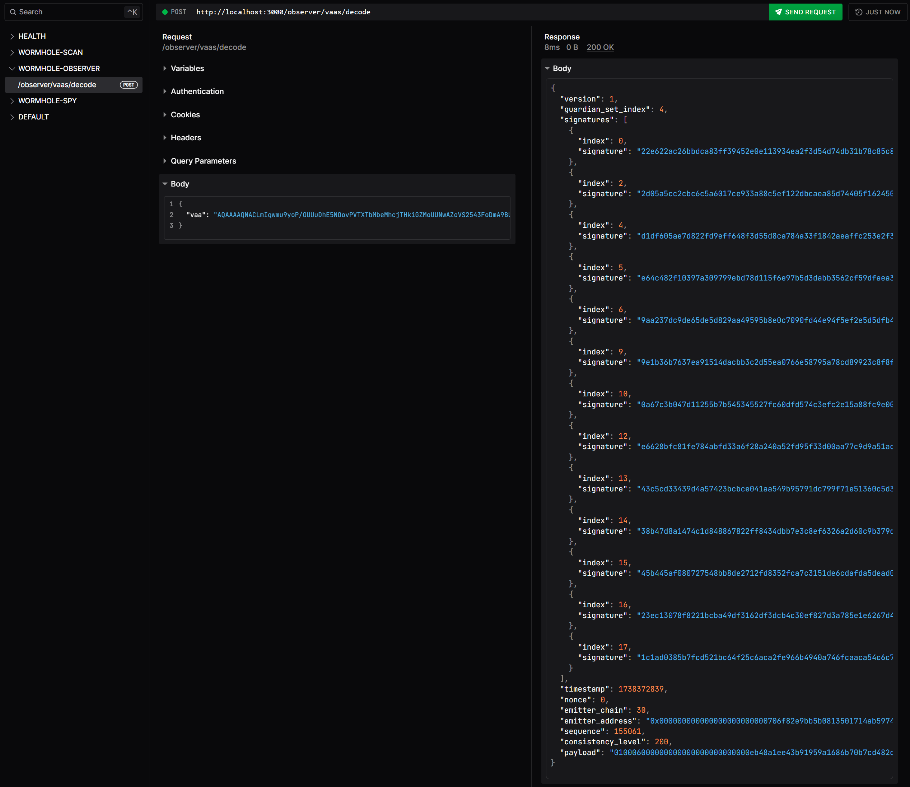

# Wormhole VAA Observer Backend

*Spoiler Alert: This is a work in progress, see API Usage section to explore capabilities.*

A Rust-based backend that integrates both Wormhole Scan via REST and Spy via gRPC.

## Overview

### Rationale

Rust is a powerful language, whereas Wormhole is a complex ecosystem of distributed systems...

Why not combine both? The idea is to explore the following use cases:
- Fetching VAAs from Wormhole Scan via REST and raw VAAs from Spy via gRPC.
- An Event Store for audit trails and reproducibility through the CQRS pattern.
- A Postgres database (with Timescale extension) for handling time series.
- Provide a mechanism to detect, track, and alert missing and duplicate VAAs.
- Exploring specific Anomaly Detection use cases (e.g., through LIME and SHAP frameworks).

### Key Features

- An uber-performant Axum REST server, Hyper REST client, and Tonic gRPC client/server.
- A simple domain-driven design (DDD) that is accessible to every seniority but highly scalable.
- Support for OpenAPI Specification (OAS) auto-documentation provided by Scalar.
- Error handling for a strongly typed codebase along with input validation.
- A proposed Command and Query Responsibility Segregation (CQRS) pattern.
- Centralized library for singletons, reusable even across other projects.
- A repository pattern with a facade for future storage extensibility.
- A health-check, liveness, and readiness endpoints for the backend lifecycle hooks.

See the [Technology ADR](../../documentation/ADR-01-TECHNOLOGY.md) and related docs for decisions beyond the chosen technologies.

## Project Structure

This project leverages a build watcher for protobufs:
```
proto                           # Protobuf definitions
├── google
│   └── api
│       ├── annotations.proto
│       └── http.proto
├── gossip
│   └── v1
│       └── gossip.proto
├── publicrpc
│   └── v1
│       └── publicrpc.proto
└── spy
    └── v1
        └── spy.proto

build.rs                        # Build watcher for protobufs
```

The main source code adheres to the following structure:
```
src
├── domain 
│   ├── health                  # Health-check domain
│   │   ├── handler.rs
│   │   └── mod.rs
│   ├── mod.rs
│   └── wormhole                # Wormhole-specific domains
│       ├── grpc                # gRPC client and handlers for Spy
│       │   ├── client.rs
│       │   ├── handlers.rs
│       │   ├── mod.rs
│       │   ├── proto.rs
│       │   └── vaa.rs
│       ├── mod.rs
│       ├── models.rs
│       └── rest                # REST client and handlers for Wormhole Scan
│           ├── client.rs
│           ├── commands
│           │   └── mod.rs
│           ├── handlers.rs
│           ├── mod.rs
│           └── queries
│               └── mod.rs
├── library                     # Library for shared functionality
│   ├── config.rs
│   ├── docs.rs
│   ├── errors.rs
│   └── mod.rs
├── main.rs                     # Application entry point
├── state.rs                    # State management
└── storage                     # Repository pattern implementation
    ├── database.rs
    ├── memory.rs               # In-memory implementation
    └── mod.rs
```

## Development flow

**Initialization**

Use cargo (the rust package manager) to install dependencies:
```
cargo install
```

For live-reloading capabilities, install the cargo-watch package:
```
cargo install cargo-watch
```
Once installed, start developing right away with:
```
cargo watch -x run
```

The API documentation will be available at: `http://127.0.0.1:3000/docs`

**Configuration**

Copy `.env.example` to `.env` and adjust values:

```env
RUST_LOG=info,wormhole_vaa_observer_backend::domain::wormhole::handler=debug
HOST=127.0.0.1
PORT=3000
API_TITLE="wormhole-vaa-observer-backend"
WORMHOLESCAN_BASE_URL="https://api.wormholescan.io/api/v1"
WORMHOLE_SPY_ADDR="127.0.0.1:30073"
```
This project requires a running Spy service, refer to the infrastructure dir for more instructions.

**Building**

The protobufs under `proto` depends on root `build.rs` file to build with command:
```
cargo build --release
```
A multi-stage Dockerfile is provided at the root level, already tested for every proto dependency required.

## API Usage

*Check Rust Axum HTTP server tracing logs for each event timestamp and UUID information.*

### Get VAAs from Wormhole Scan


**Method**
`GET /wormhole/scan/vaas/{chain_id}/{emitter}`

**Parameters**
- `chain_id`: Chain ID (e.g., 2 for Ethereum, 30 for Optimism)
- `emitter`: 32-byte hex address of the emitter

**Response payload**
```json
{
  "metadata": {
    "total_items": 50,
    "total_duplicates": 0,
    "duplicated_sequences": [],
    "lowest_sequence": 155060,
    "highest_sequence": 155109,
    "sequence_gaps": [],
    "total_gaps": 0
  },
  "data": [
    {
      "sequence": 155060,
      "id": "30/000000000000000000000000706f82e9bb5b0813501714ab5974216704980e31/155060",
      "version": 1,
      "emitterChain": 30,
      "emitterAddr": "000000000000000000000000706f82e9bb5b0813501714ab5974216704980e31",
      "emitterNativeAddr": "0x706f82e9bb5b0813501714ab5974216704980e31",
      "guardianSetIndex": 4,
      "vaa": "<REDACTED-BASE64-ENCODED-BINARY-VAA>",
      "timestamp": "2025-02-01T01:20:33Z",
      "updatedAt": "2025-02-01T01:45:11.290605Z",
      "indexedAt": "2025-02-01T01:45:11.290605Z",
      "txHash": "2edf49d5ca38cb81e75ade8bea22dd9d7a3ada855d9234593688e0d1af66d71d",
      "digest": "396ce90b28d32c4d7bc5875965a6bd264702223b4479686a974afbd70bc843a7",
      "isDuplicated": false
    },
    ... // more VAAs
  ]
}
```

The VAA is Base64-encoded but contains binary data, see below `/observer/vaas/decode` endpoint for details.

*Expect that sometimes Wormhole Scan will not have missing VAAs, so our crafted metadata will be mostly empty.*

**Example**

```bash
curl 'http://127.0.0.1:3000/wormhole/scan/vaas/30/000000000000000000000000706f82e9bb5b0813501714ab5974216704980e31'
```

### Get raw VAAs from a Wormhole Spy instance


**Method**
`GET /wormhole/spy/vaas/`

**Example**
```bash
curl 'http://127.0.0.1:3000/wormhole/spy/vaas'
```


### Decode a VAA's binary contents



**Method**
`POST /wormhole/observer/vaas/decode`

**Request Body**
```json
{
  "vaa": "<base64-encoded-vaa>"
}
```

**Response payload**
```json
{
  "version": 1,
  "guardian_set_index": 4,
  "signatures": [
    {
      "index": 0,
      "signature": "f35ea5b224721f9c2dcdea01833374291f914ea4e8b2b5d19d28a434797fdb591f7fe56c84d692b297fcd093a84ad76142a5d528a7212e36f565b729af8e100f01"
    }
    // ... more signatures
  ],
  "timestamp": 1643673600,
  "nonce": 123,
  "emitter_chain": 30,
  "emitter_address": "0x706f82e9bb5b0813501714ab5974216704980e31",
  "sequence": 155060,
  "consistency_level": 1,
  "payload": "00000000..." // Optional hex-encoded payload
}
```

**Example**
```bash
curl -X POST 'http://127.0.0.1:3000/wormhole/observer/vaas/decode' \
  -H 'Content-Type: application/json' \
  -d '{
    "vaa": "AQAAAAQNAPNepbIkch+cLc3..."
  }'
```

The endpoint decodes a base64-encoded VAA into its constituent parts according to the [Wormhole VAA specification](../../documentation/ADR-02-DOMAINS.md#vaa-structure).
